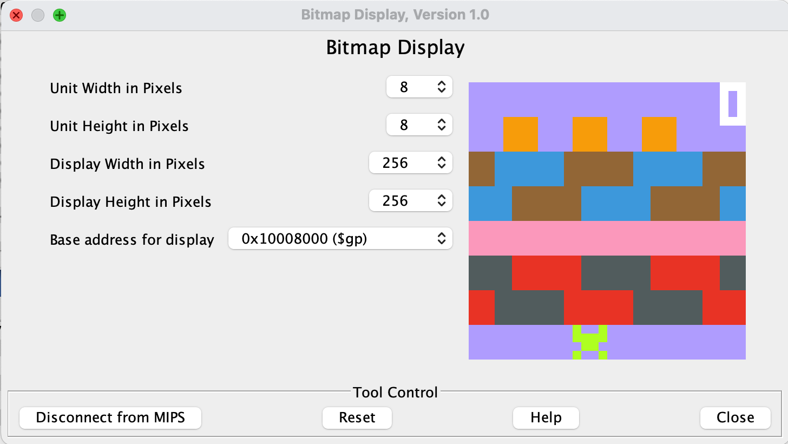

# MIPS Assembly - Frogger Game

## 🐸 I. How does it look like?

- Your little green frog starts at the bottom row
- Grey road & red car row: Avoid the cars!
- Pink row: safe area
- Water & Log row: Stay on logs! Do not fall into water
- Orange destination: Pass one level by fulfilling all 3 orange houses
- Your score is at top-right corner

**Difficulty increases as level increases.**

## 🙋🏼‍♀️ II. How to setup and play?
1) 🧩 Download MARS v4.5 [here](http://courses.missouristate.edu/kenvollmar/mars/download.htm).
2) 📂 Open `frogger.asm` in MARS.
3) 🖥 Set up display in `Tools > Bitmap Display`:
    - Unit width in pixels: 8
    - Unit height in pixels: 8
    - Display width in pixels: 256
    - Display height in pixels: 256
    - Base Address for Display: 0x10008000 ($gp)
    - once above are all set, click `Connect to MIPS` at the bottom left corner
4) ⌨️ Set up keyboard in `Tools > Keyboard and display MMIO simulator`:
   - Click `Connect to MIPS`. (Note: With bitmap display screen open)
5) 🛠 Build the game: 
   - `Run > Assembly`
   - `Run > Go`
6) 🥳 Play the game: 
   - Use `w`, `s`, `a`, `d` to move the frog and play. 
   - **Pass one level by fulfilling all 3 orange houses on top!**
   - 🎊 Enjoy!

Note: This is my final project of course CSC258 from University of Toronto.
